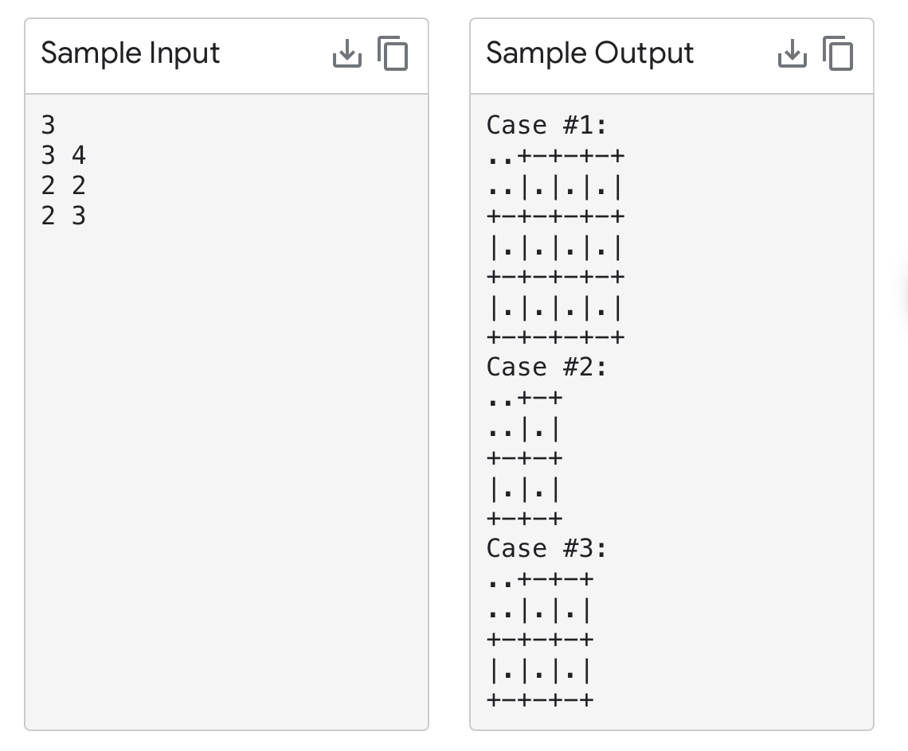

# OVERVIEW

For this exercise, we tackled a Google Code Jam problem related to generating ASCII art of punched cards with varying dimensions. The team gathered to discuss an algorithmic solution for the problem. We then formed pairs and assigned each pair a programming language (Dart, Kotlin, Python, and TypeScript) to implement the solution. My partner and I were responsible for developing the TypeScript implementation.

# CONTEXT

The problem at hand requires us to create an ASCII art representation of punched cards of varying sizes, as specified by input values R (rows) and C (columns). The punched cards resemble an R×C matrix without the top-left cell, resulting in a total of (R ⋅ C) - 1 cells. Each cell in the ASCII art is represented by a period (.) surrounded by dashes (-) above and below, pipes (\|) to the left and right, and plus signs (+) for each corner. Adjacent cells share common characters in their borders, and periods (.) are used to align the cells in the top row.

The input consists of T, the number of test cases, followed by T lines, each containing two integers R and C representing the number of rows and columns of the punched card to be drawn. The output should begin with "Case #x:" where x is the test case number (starting from 1), followed by (2⋅ R)+1 lines displaying the ASCII art drawing of a punched card with R rows and C columns.

# SOLUTION

As a team, we came up with an algorithm to solve the problem during a call where we discussed the problem at hand and brainstormed possible solutions. After some casual discussion, we developed an algorithm that more formally consists of the following steps:

1. Read the number of test cases T from the input.
2. For each test case, do the following:
    1. Read the input values for the number of rows R and columns C.
    2. Initialize the punched card ASCII art as an empty string.
    3. Construct the top row without the top-left cell:
        1. Append "..+" to the ASCII art.
        2. Repeat "-+" (C - 1) times and append it to the ASCII art.
        3. Append a newline character to the ASCII art.
    4. Construct the row with periods and pipes:
        1. Append "." to the ASCII art.
        2. Repeat ".\|" C times and append it to the ASCII art.
        3. Append a newline character to the ASCII art.
    5. Construct the row with plus signs, dashes, and pipes:
        1. Append "+-" to the ASCII art.
        2. Repeat "-+" C times and append it to the ASCII art.
        3. Append a newline character to the ASCII art.
    6. Assemble the punched card:
        1. Repeat steps 2.4 and 2.5 for (R - 1) times.
        2. Append the row constructed in step 2.5 to the ASCII art, removing the last character.
    7. Print the output, which includes the test case number and the corresponding ASCII art.

In our TypeScript implementation, we used two functions, createRow and cardBuilder, to generate the rows and assemble the punched card, respectively. We then implemented a loop to iterate through the test cases, parse the input, and generate the punched card ASCII art using the cardBuilder function for each test case.

My individual contribution to this solution involved constructing individual rows and assembling the punched card. I focused on implementing the initial version of the createRow and cardBuilder functions. My partner then took my code and made the necessary modifications to read the user input and implement a main() function.
