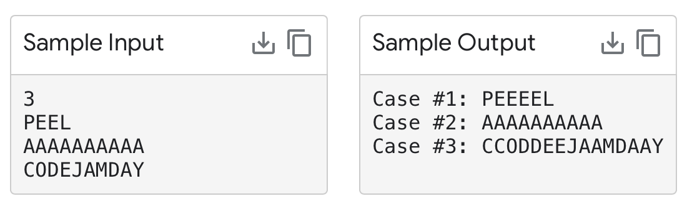

# OVERVIEW 
In this document, you will find a detailed explanation of a Google Jam problem that involves generating new strings from a given string by choosing any combination of letters and duplicating them in the new string. The goal is to determine the lexicographically smallest string that can be produced from this process. By the end of this document, you will have a clear understanding of the problem, the underlying logic to solve it, and a simplified algorithm to get the desired result.

# CONTEXT

This problem asks you to highlight any number of uppercase letters in a given string and append them twice in a new string, while appending non-highlighted letters once. The resulting strings can be sorted alphabetically, and this problem asks you to find the first string in that sorted order. 

The input contains multiple test cases, and for each test case, you need to output the first string in alphabetical order that can be produced from the given string by highlighting any number of letters and processing them as described above. The output for each test case should contain the case number and the resulting string.

# SOLUTION
To solve this challenge, I knew that in general terms the solution code should iterate through the characters in the input string and if the next character is lexicographically smaller, append the current character to the result string, otherwise, append the current character twice to the result string. Following this logic, I wrote a Java code that executes the following steps:

1. Read the number of test cases T.
2. For each test case, do the following:
   1. Read the input string.
   2. Group the input string into continuous identical characters using the `groupCharacters` method.
      1. Initialize an empty list of pairs to store the groups.
      2. Set the current character to the first character of the input string and initialize a count variable.
      3. Iterate through the input string, comparing each character with the current character.
         1. If the character is the same as the current character, increment the count.
         2. If the character is different, add a pair containing the current character and count to the list of groups. Update the current character and reset the count.
      4. Add the last group of characters to the list of groups.
   3. Compute the lexicographically smallest string using the `getSmallestString` method.
      1. Initialize an empty string builder for the result.
      2. Iterate through the grouped characters.
         1. For each group, check if the current character is lexicographically smaller than the next group's character.
            1. If true, append the current character twice its count to the result.
            2. If false, append the current character its count to the result.
   4. Print the test case number and the computed lexicographically smallest string.

